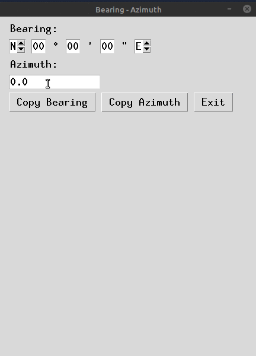

=====
Usage
=====

The Bearing / Azimuth application is a stand-alone utility that does a
conversion between bearings and azimuth.

As you enter the information into the form, the fields will update based
on your input.

Note: The Bearing class located in angle.py.  This class may be
useful outside of this little utility.
